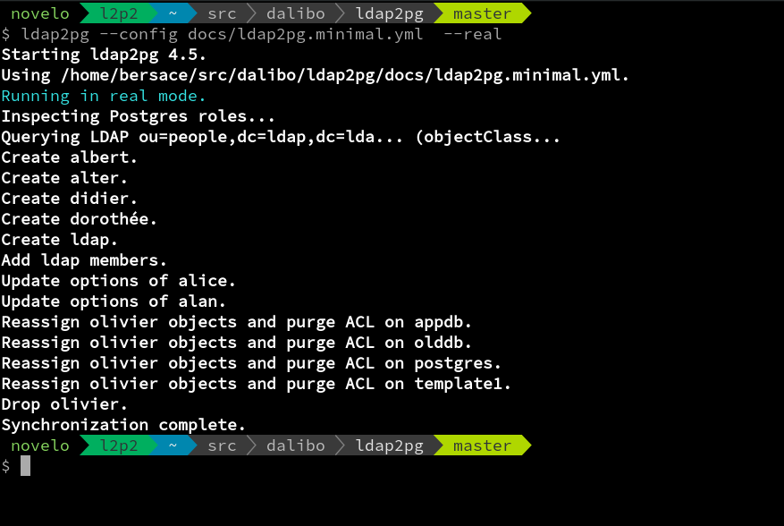

---
hide:
  - navigation
---

<h1 style="display: none"><a href="https://labs.dalibo.com/ldap2pg"><code>ldap2pg</code></a></h1>

Postgres is able to check password of an existing role using the LDAP protocol out of the box.
ldap2pg automates the creation, update and removal of PostgreSQL roles and users from an entreprise directory.

Managing roles is close to managing privileges as you expect roles to have proper default privileges.
ldap2pg can grant and revoke privileges too.

# Features

- Reads settings from an expressive YAML config file.
- Creates, alters and drops PostgreSQL roles from LDAP searches.
- Creates static roles from YAML to complete LDAP entries.
- Manages role parents (alias *groups*).
- Grants or revokes privileges statically or from LDAP entries.
- Dry run, check mode.
- Logs LDAP searches as `ldapsearch(1)` commands.
- Logs **every** SQL statements.

`ldap2pg` is licensed under [PostgreSQL license](https://opensource.org/licenses/postgresql).

ldap2pg **requires** a configuration file called `ldap2pg.yaml`.
Project ships a [tested ldap2pg.yml](https://github.com/dalibo/ldap2pg/blob/master/ldap2pg.yml) as a starting point.

`ldap2pg` is reported to work with [OpenLDAP](https://www.openldap.org/),
[FreeIPA](https://www.freeipa.org/),
Oracle Internet Directory and
Microsoft Active Directory.

# Support

If you need support
and you didn't found it in [documentation](https://ldap2pg.readthedocs.io/),
just drop a question in a [GitHub issue](https://github.com/dalibo/ldap2pg/issues/new)!
French accepted.
Don't miss the [cookbook](https://ldap2pg.readthedocs.io/en/latest/cookbook/) for advanced use cases.

# Authors

ldap2pg is a [Dalibo Labs](https://labs.dalibo.com/) project.

- [Étienne BERSAC](https://github.com/bersace) is the maintainer.
- [Damien Cazeils](https://www.damiencazeils.com) designed the logo.
- [Harold le CLÉMENT de SAINT-MARCQ](https://github.com/hlecleme) implemented LDAP sub searches.
- [Randolph Voorhies](https://github.com/randvoorhies) implemented role configuration synchronization.
